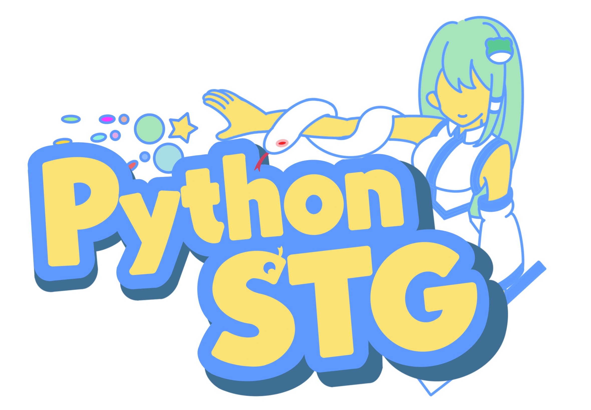

# PySTG

**Python东方Project风格弹幕射击游戏引擎** - 开发中

<p align="center">
  
</p>


---

## 已完成 ✅

### 核心系统
- [x] 基础游戏循环 (pygame-ce + ModernGL)
- [x] 高性能子弹池 (Numba加速，20000+弹幕60fps)
- [x] 碰撞检测 (判定点/擦弹)
- [x] 激光系统 (直线激光、曲线激光)
- [x] 道具系统 (P点、点数、残机、符卡)

### 玩家系统
- [x] 可配置的玩家基类
- [x] 外部脚本定义自机行为 (射击模式、Option布局)
- [x] 高速/低速移动、判定点显示
- [x] 精灵动画 (左右倾斜)
- [x] 示例自机：十六夜咲夜

### 渲染系统
- [x] 纹理图集管理 (统一资产系统)
- [x] 实例化渲染 (子弹批量绘制)
- [x] 不同尺寸子弹正确渲染
- [x] 玩家/Option精灵渲染
- [x] 激光渲染器

### UI系统
- [x] 位图字体渲染
- [x] HUD面板 (残机、符卡、得分、Power等)
- [x] 可配置布局 (JSON)

### 敌人系统
- [x] 敌人基类与状态机 (待机/移动/攻击/受击/死亡)
- [x] 敌人管理器 (生成/更新/清理)
- [x] 攻击模式生成器 (协程驱动弹幕)
- [x] 预设敌人行为 (向日葵妖精等)
- [x] 碰撞盒与受击判定

### 关卡系统
- [x] 协程驱动的关卡脚本 (极简流程控制)
- [x] 关卡/波数管理
- [x] Boss基类与战斗流程
- [x] SpellCard系统 (符卡声明与结算)
- [x] 练习模式支持

### 背景系统
- [x] 3D背景渲染器 (透视投影)
- [x] 数据驱动背景配置 (JSON定义)
- [x] 程序化背景生成 (如湖面反射效果)
- [x] 雾效与光照

### 音频系统
- [x] 双层音频管理 (全局/关卡私有)
- [x] BGM播放控制 (循环/淡入淡出/记忆播放)
- [x] SE音效池 (自动加载/多通道混合)
- [x] 音量独立控制

### 工具
- [x] 精灵表切割器
- [x] 纹理资产编辑器
- [x] UI布局编辑器
- [x] 玩家配置编辑器
- [x] LuaSTG配置转换器

---

## 进行中 🚧

- [ ] 更多种类的敌人和行为模式
- [ ] 完整的关卡内容设计 (目前主要是第1面和测试关)
- [ ] 完善的得分与结算系统
- [ ] 更多样化的Boss符卡

---

## 待开发 📋

- [ ] 游戏主菜单/标题画面
- [ ] Replay录像系统
- [ ] 游戏设置界面 (按键绑定/画质设置)
- [ ] 可视化关卡编辑器
- [ ] 更多可选自机
- [ ] 完善的使用文档

---

## 快速开始

```bash
# 依赖
pip install pygame-ce moderngl numpy numba pillow

# 运行测试
python main.py
```

## 项目结构

```
src/
├── game/          # 游戏逻辑
│   ├── bullet/    # 子弹池
│   ├── player/    # 玩家系统
│   ├── stage/     # 关卡/符卡系统
│   └── ...
├── render/        # 渲染器
├── resource/      # 资源管理
└── ui/            # UI系统

tools/             # 编辑器工具
assets/            # 游戏资源
game_content/      # 关卡内容
```

---

## 关于AI

本仓库大量使用AI辅助开发。代码质量...能跑就行。

## Thlib资源版权

仓库中\assets中很多资源的来源是Thlib,具体版权成谜，如果需要商用请注意。