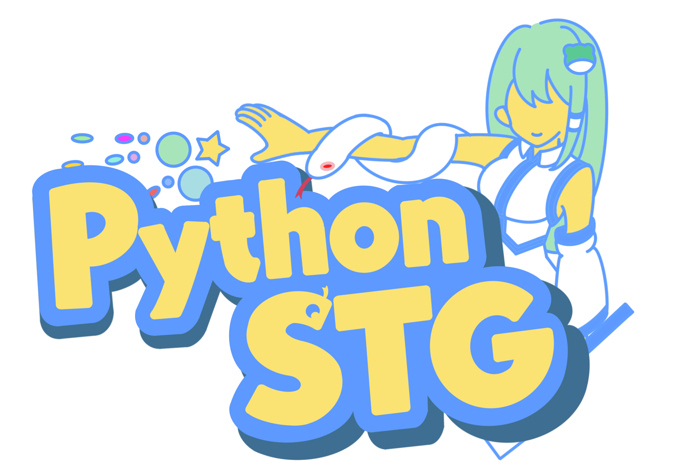

# PySTG

**Python + OpenGL 实现的东方 Project 风格弹幕射击游戏引擎。**

<p align="center">
  
</p>

<p align="center">
  <a href="https://www.python.org/downloads/"></a>
  <a href="LICENSE"></a>
  
</p>

PySTG 是一个面向**关卡内容创作者**和**引擎二次开发者**的弹幕射击游戏框架。
引擎层使用 ModernGL 实例化渲染 + Numba JIT 加速的子弹池，可稳定支持 20000+ 颗弹幕同屏 60fps；
内容层通过 `async/await` 协程脚本编写关卡、波次、Boss 符卡，与引擎彻底解耦。

## 介绍
    这个项目是九州拾遗东方例会出现的游戏所在的仓库。
    
---

## 主要特性

- 🚀 **高性能弹幕** — `OptimizedBulletPool` 基于 NumPy 结构化数组 + Numba JIT，OpenGL 实例化渲染
- 🎮 **协程化关卡脚本** — 用 `async/await` 描述弹幕时序，无回调地狱
- 🎯 **完整 STG 玩法** — 判定点 / 擦弹 / Power / 符卡 / Bomb / 道具掉落 / 练习模式
- 🌟 **激光系统** — 直线激光（三段式：展开→持续→收缩）+ 曲线激光
- 📦 **数据驱动资产** — 纹理图集、精灵动画、弹幕别名表全部 JSON 配置
- 🎨 **可视化编辑器** — 弹幕别名管理器、纹理资产编辑器、自机编辑器、对话立绘编辑器
- 🔊 **双层音频** — 全局 bank + 关卡私有 bank，关卡音效可覆盖全局同名音效
- 🌅 **3D 背景** — 透视投影 + 雾效 + 程序化生成（如湖面反射）
- 🛠 **Debug 模式** — 一键跳转任意 Wave / Boss / 符卡，加速开发迭代
- 💬 **QQ 群弹幕互动** — 内置 UDP 监听器，接 NoneBot/Mirai 把直播间表情转化为攻击玩家的 emoji 弹

---

## 快速开始

### 环境要求

- Python **3.10+**（推荐 3.12）
- 支持 OpenGL **3.3+** 的显卡

### 安装

```bash
git clone https://github.com/qwqpap/PythonSTG.git
cd PythonSTG
pip install -r requirements.txt
```

### 运行

```bash
# 默认从 Stage 1 开始
python main.py

# 资产预览模式（浏览所有弹型/敌人）
python main.py --stage=asset_preview

# Debug 模式（菜单可跳转任意 Wave / Boss / 符卡）
python main.py --debug

# 性能分析
python main.py --profile
```

### 开发依赖（编辑器与测试）

```bash
pip install -r requirements-dev.txt
pip install PyQt5   # 编辑器工具
```

---

## 项目结构

```
PythonSTG/
├── main.py                      # 入口、主循环、游戏状态机
├── src/                         # 引擎代码
│   ├── core/                    # 配置、碰撞、窗口、输入
│   ├── game/
│   │   ├── bullet/              # 子弹池（Numba JIT + NumPy 结构化数组）
│   │   ├── stage/               # 关卡系统核心（StageScript / Wave / SpellCard / Context）
│   │   ├── player/              # 玩家、射击、Option、动画状态机
│   │   ├── boss/                # Boss 管理
│   │   ├── laser.py             # 激光系统（直线 / 曲线，池化管理）
│   │   ├── item.py              # 道具系统
│   │   └── audio.py             # 双层音频
│   ├── render/                  # OpenGL 渲染管线（实例化渲染）
│   ├── resource/                # 纹理图集 / 精灵管理
│   └── ui/                      # HUD、对话框、菜单
│
├── game_content/                # 关卡内容（写弹幕在这里，与引擎解耦）
│   └── stages/
│       ├── stage1/              # Stage 1（最完整的参考实现）
│       ├── stage2/ stage3/      # 后续关卡（骨架）
│       └── stage_test/          # 测试关卡
│
├── assets/                      # 全局游戏资源
│   ├── images/                  # 子弹/敌人/玩家/道具/UI 图集
│   ├── audio/                   # 全局 SE 与 BGM
│   ├── fonts/                   # 位图字体
│   ├── players/                 # 自机配置
│   ├── configs/                 # 敌人预设等 JSON 配置
│   └── bullet_aliases.json      # 弹幕类型 + 颜色 → 精灵 映射表
│
├── tools/                       # PyQt5 编辑器工具
│   ├── editor_launcher.py       # 统一启动器
│   ├── bullet_alias_manager.py  # 弹幕别名管理器
│   ├── asset_manager_qt.py      # 纹理资产编辑器
│   └── player_editor.py         # 自机编辑器
│
├── docs/                        # 文档（mkdocs）
└── tests/                       # 单元测试
```

---

## 文档

完整文档位于 [`docs/`](docs/) 目录，按受众分两条线：

### 给内容开发者（写关卡 / 弹幕 / Boss）

| 文档 | 内容 |
|------|------|
| [快速开始](docs/getting-started.md) | 环境搭建、第一份脚本、目录约定 |
| [弹幕脚本开发指南](docs/STAGE_SCRIPTING_GUIDE.md) | 完整 API 参考、符卡/波次/敌人/Boss 编写方法 |
| [敌人预设系统](docs/ENEMY_PRESET_SYSTEM.md) | 用 JSON 预设快速创建杂兵 |
| [编辑器工具](docs/EDITOR_TOOLS_GUIDE.md) | 弹幕别名管理器、纹理编辑器、自机编辑器 |

### 给引擎开发者（修引擎 / 加新模块）

| 文档 | 内容 |
|------|------|
| [架构概览](docs/architecture.md) | 引擎分层、模块依赖、数据流 |
| [纹理资产系统](docs/TEXTURE_ASSET_SYSTEM.md) | 图集加载、精灵定义、动画配置 |

也可以本地启 mkdocs 站点：

```bash
pip install mkdocs mkdocs-material
mkdocs serve
```

---

## 一段最简符卡示例

```python
from src.game.stage.spellcard import SpellCard

class MySpell(SpellCard):
    name = "火符「Example」"
    hp = 1000
    time_limit = 45

    async def setup(self):
        await self.boss.move_to(0, 0.6, duration=30)

    async def run(self):
        angle = 0
        while True:
            self.fire_circle(
                count=12, speed=2.0,
                start_angle=angle,
                bullet_type="ball_m", color="red",
            )
            angle += 10
            await self.wait(15)
```

挂到 Boss 上：

```python
from src.game.stage.stage_base import StageScript, BossDef
from src.game.stage.boss_base import nonspell, spellcard

class Stage1(StageScript):
    boss = BossDef(
        id="my_boss", name="Boss", texture="enemy_boss",
        phases=[
            nonspell(NonSpell1, hp=800, time=30, bonus=100000),
            spellcard(MySpell, "火符「Example」", hp=1000, time=45),
        ],
    )

    async def run(self):
        await self.run_boss(self.boss)
```

更多见 [弹幕脚本开发指南](docs/STAGE_SCRIPTING_GUIDE.md)。

---

## QQ 群弹幕互动（UDP 协议）

PySTG 内置一个 UDP 监听器（`src/game/emoji_danmaku/udp_receiver.py`），默认监听 `127.0.0.1:9999`。
任何外部程序（NoneBot 插件、Mirai HTTP API、自写脚本……）只要往这个端口发 JSON UDP 包，
群成员发的 emoji 就会变成飘落+攻击玩家的弹幕。

### 消息格式

UDP 包必须是一行 **UTF-8 编码的 JSON**，支持两种 `cmd`：

#### 1. 直接发 emoji（`cmd: "emoji"`）

```json
{
  "cmd": "emoji",
  "emoji": "😂",
  "nickname": "群友A",
  "user_id": 10001
}
```

#### 2. 通过 `/stg` 指令转发（`cmd: "stg"`）

```json
{
  "cmd": "stg",
  "args": "😂",
  "nickname": "群友A",
  "user_id": 10001
}
```

### 字段说明

| 字段 | 类型 | 必填 | 说明 |
|------|------|------|------|
| `cmd` | string | ✓ | 必须是 `"emoji"` 或 `"stg"` |
| `emoji` | string | `cmd=emoji` 时必填 | 单个 emoji 字符 |
| `args` | string | `cmd=stg` 时必填 | 单个 emoji 字符（`/stg <emoji>` 的参数） |
| `nickname` | string | 否 | 发送者昵称，预留给后续显示用 |
| `user_id` | int | 否 | 发送者 QQ 号，预留 |

### 当前支持的 emoji

只有这 4 个 emoji 会被引擎识别（其他会被静默丢弃）：

| Emoji | 含义 |
|-------|------|
| 😂 | 笑死 |
| 😡 | 怒 |
| 💩 | 大便 |
| 😅 | 苦笑 |

如要扩展，编辑 [src/game/emoji_danmaku/udp_receiver.py](src/game/emoji_danmaku/udp_receiver.py) 顶部的 `EMOJI_SET` 即可。

### 端口与地址

默认值在 [src/game/emoji_danmaku/__init__.py](src/game/emoji_danmaku/__init__.py) 里写死为 `127.0.0.1:9999`（即只接受本机），如需暴露到局域网，初始化时传入参数：

```python
EmojiDanmakuSystem(
    ctx=ctx, screen_size=screen_size,
    game_viewport=game_viewport, panel_origin=panel_origin,
    udp_host="0.0.0.0",   # 监听所有网卡
    udp_port=9999,
)
```

> ⚠️ **安全提醒**：`0.0.0.0` 会接收任何来源的 UDP 包，在公网环境下可能被滥用。
> 如果直播主机和 Bot 不在同一台机器上，建议用 SSH 隧道或专用内网回环。

### 最小发送端示例（Python）

```python
import json, socket

def send_emoji(emoji: str, nickname="anon", user_id=0):
    payload = {
        "cmd": "emoji",
        "emoji": emoji,
        "nickname": nickname,
        "user_id": user_id,
    }
    sock = socket.socket(socket.AF_INET, socket.SOCK_DGRAM)
    sock.sendto(json.dumps(payload).encode("utf-8"), ("127.0.0.1", 9999))

send_emoji("😂", "测试群友", 10086)
```

### NoneBot 适配示例

```python
# nonebot_plugin/__init__.py（节选）
import json, socket
from nonebot import on_command, on_message
from nonebot.adapters.onebot.v11 import MessageEvent

EMOJI_SET = {"😂", "😡", "💩", "😅"}
SOCK = socket.socket(socket.AF_INET, socket.SOCK_DGRAM)
TARGET = ("127.0.0.1", 9999)

stg_cmd = on_command("stg")

@stg_cmd.handle()
async def _(event: MessageEvent):
    args = str(event.get_message()).replace("/stg", "").strip()
    if args in EMOJI_SET:
        SOCK.sendto(json.dumps({
            "cmd": "stg",
            "args": args,
            "nickname": event.sender.nickname or "",
            "user_id": event.user_id,
        }).encode("utf-8"), TARGET)
```

---

## 路线图

### 已完成 ✅

- 核心引擎（子弹池、激光、碰撞、道具、音频、渲染管线）
- 玩家系统（移动、射击、Option、动画状态机、判定点）
- 关卡系统（StageScript / Wave / SpellCard / Boss / 对话 / 练习模式）
- 数据驱动背景（3D 透视 + 雾效 + 程序化湖面）
- 编辑器工具（弹幕别名、纹理资产、自机、对话立绘、UI 布局）
- 示例自机：十六夜咲夜
- 完整 Stage 1 内容

### 进行中 🚧

- 更多敌人行为模式
- Stage 2 / Stage 3 完整内容
- 完善的得分与结算系统
- 更多 Boss 符卡模板

### 待开发 📋

- Replay 录像系统
- 游戏设置界面（按键绑定、画质）
- 可视化关卡编辑器
- 更多可选自机

---

## 贡献

欢迎 PR / Issue。建议在动手前：

1. 阅读 [`CLAUDE.md`](CLAUDE.md) 了解仓库约定
2. 阅读对应的开发文档（脚本指南 / 架构概览）
3. 写关卡内容请放 `game_content/stages/stageN/`，不要修改 `src/`
4. 引擎层修改请保持 Numba 兼容（子弹池里不能用 Python 对象）

跑测试：

```bash
pytest                # 全量
pytest -m smoke       # 仅快速回归
```

---

## 协议

代码以 [MIT License](LICENSE) 开源。

### 资源版权

`assets/` 中部分纹理与音频资源来自 **Thlib** 等社区资源库，版权归原作者所有。
**商用前请自行确认资源来源与授权**——本仓库仅用于学习、研究和非商业再创作。

如发现侵权资源，请提 Issue，作者会及时替换。

其余立绘资源与音乐资源均不可转载不可商用，务必注意

---

## 关于 AI

本仓库在开发过程中大量使用 AI 辅助。代码质量……能跑就行 :)
欢迎 PR 把那些"能跑但不优雅"的部分变得更好。

---

## 链接

- GitHub: <https://github.com/qwqpap/PythonSTG>
- 在线文档: <https://qwqpap.github.io/PythonSTG/>
