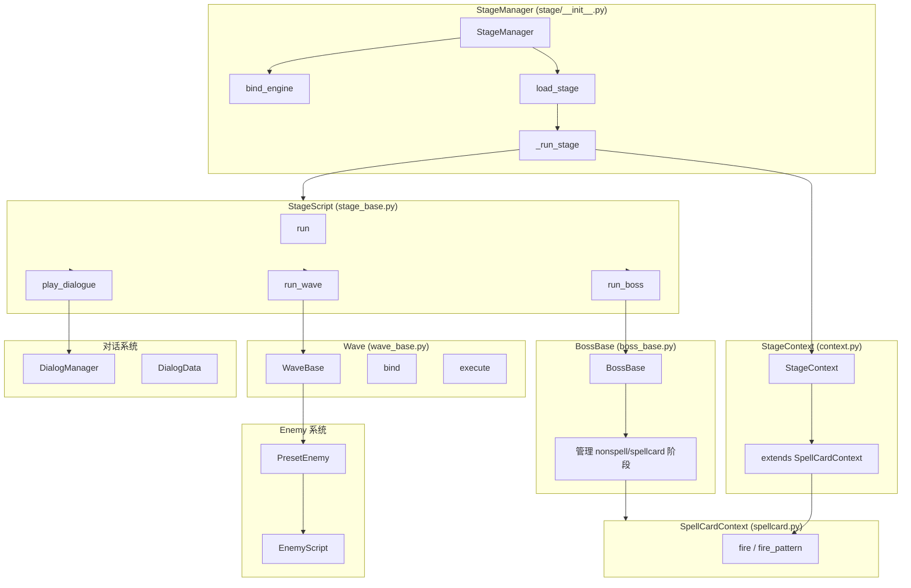
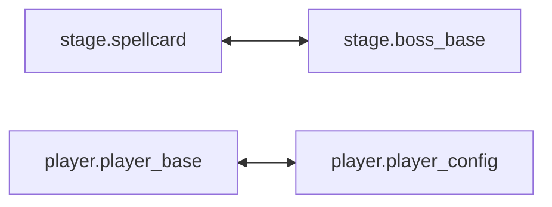
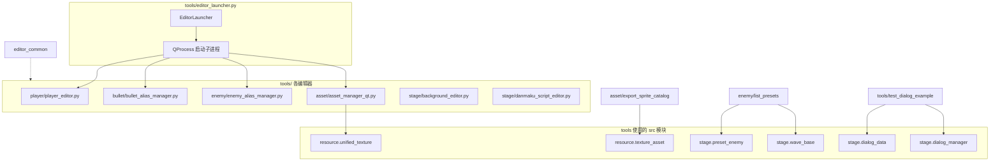
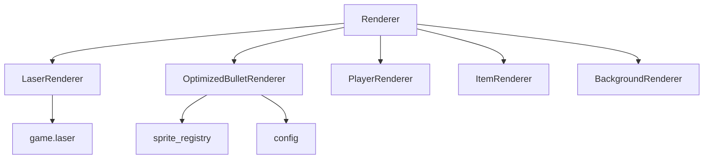

# pystg 项目架构与依赖结构图

## 1. 整体架构概览

```
┌─────────────────────────────────────────────────────────────────────────────────┐
│                              入口层 (Entry Points)                                │
├─────────────────────────────────┬─────────────────────────────────────────────────┤
│         main.py (游戏)           │      tools/editor_launcher.py (编辑器)          │
└────────────────┬────────────────┴────────────────┬────────────────────────────────┘
                 │                                  │
                 ▼                                  ▼
┌─────────────────────────────────────────────────────────────────────────────────┐
│                              src/ 核心引擎层                                      │
├──────────────┬──────────────┬──────────────┬──────────────┬──────────────────────┤
│   src.core   │ src.resource │  src.game    │  src.render  │      src.ui          │
│ (配置/碰撞)   │ (纹理/精灵)   │ (游戏逻辑)   │  (渲染管线)   │   (HUD/菜单/对话框)   │
└──────────────┴──────────────┴──────────────┴──────────────┴──────────────────────┘
                 │                                  │
                 ▼                                  ▼
┌─────────────────────────────────────────────────────────────────────────────────┐
│                         game_content/ 关卡内容层                                  │
│                    stages/stage1, stage2, stage3...                              │
└─────────────────────────────────────────────────────────────────────────────────┘
```

---

## 2. main.py 游戏启动依赖流

```mermaid
flowchart TB
    subgraph Entry["main.py 入口"]
        main[main()]
        init_pygame[initialize_pygame_and_context]
        run_menu[run_main_menu]
        load_res[load_resources]
        init_game[initialize_game_objects]
    end

    subgraph Core["src.core"]
        config[config: GameConfig]
        collision[collision: CollisionManager]
        sprite_reg[sprite_registry]
    end

    subgraph Resource["src.resource"]
        texture_asset[texture_asset: TextureAssetManager]
        sprite[sprite: SpriteManager]
    end

    subgraph Game["src.game"]
        bullet[bullet: BulletPool]
        player[player: Player]
        stage[stage: StageManager]
        boss[boss: BossManager]
        laser[laser: LaserPool]
        item[item: ItemPool]
        audio[audio: AudioManager]
    end

    subgraph Render["src.render"]
        renderer[Renderer]
        item_renderer[ItemRenderer]
    end

    subgraph UI["src.ui"]
        hud[HUD]
        ui_renderer[UIRenderer]
        dialog_gl[DialogGLRenderer]
        loading[LoadingScreenRenderer]
        main_menu[MainMenuRenderer]
    end

    subgraph Content["game_content"]
        stage1[stage1.stage_script.Stage1]
    end

    main --> init_pygame
    main --> run_menu
    main --> load_res
    main --> init_game

    init_pygame --> config
    load_res --> texture_asset
    init_game --> bullet
    init_game --> player
    init_game --> stage
    init_game --> boss
    init_game --> laser
    init_game --> item
    init_game --> audio
    init_game --> renderer
    init_game --> item_renderer
    init_game --> hud
    init_game --> ui_renderer
    init_game --> dialog_gl
    init_game --> loading
    init_game --> main_menu
    init_game --> stage1
```

---

## 3. 模块依赖层级图

```mermaid
flowchart LR
    subgraph Layer0["第0层 - 无内部依赖"]
        config[core.config]
        interfaces[core.interfaces]
        collision[core.collision]
        sprite_reg[core.sprite_registry]
        entity[game.entity]
        dialog_data[stage.dialog_data]
    end

    subgraph Layer1["第1层"]
        texture_asset[resource.texture_asset]
        sprite[resource.sprite]
        boss[game.boss]
        spellcard[stage.spellcard]
        boss_base[stage.boss_base]
        wave_base[stage.wave_base]
        enemy_script[stage.enemy_script]
    end

    subgraph Layer2["第2层"]
        bullet_pool[game.bullet]
        player_base[game.player]
        context[stage.context]
        stage_base[stage.stage_base]
        preset_enemy[stage.preset_enemy]
    end

    subgraph Layer3["第3层"]
        stage_mgr[stage.StageManager]
        laser[game.laser]
        item[game.item]
        audio[game.audio]
    end

    subgraph Layer4["第4层 - 整合层"]
        renderer[render.Renderer]
        main[main.py]
    end

    Layer0 --> Layer1
    Layer1 --> Layer2
    Layer2 --> Layer3
    Layer3 --> Layer4
```



---

## 4. Stage 系统内部依赖（关卡核心）



---

## 5. 循环依赖关系（需注意）



- **spellcard ↔ boss_base**: 通过 `TYPE_CHECKING` 延迟导入避免循环
- **player_base ↔ player_config**: 同上

---

## 6. Tools 编辑器与 src 的依赖



---

## 7. 渲染管线结构



---

## 8. 实体与游戏对象继承关系

```
Entity (game/entity)
├── Boss (game/boss)          # 旧版，由 BossManager 管理
└── PlayerBase (game/player)  # 别名 Player
    ├── PlayerBulletPool
    ├── PlayerShotSystem
    ├── PlayerAnimationStateMachine
    └── PlayerScript
```

---

## 9. 目录结构速查

```
pystg/
├── main.py                     # 游戏入口
├── tools/
│   ├── editor_launcher.py      # 编辑器启动器
│   ├── editor_common.py       # 工具共享
│   ├── asset/                 # 资源管理工具
│   ├── bullet/                # 子弹别名管理
│   ├── dialog/                # 对话框编辑
│   ├── enemy/                 # 敌机管理
│   ├── player/                # 玩家编辑器
│   └── stage/                 # 关卡编辑
├── src/
│   ├── core/                  # 配置、碰撞、接口、精灵注册
│   ├── game/                  # 子弹、玩家、Boss、关卡、激光、道具、音频
│   ├── render/                # 渲染器
│   ├── resource/              # 纹理、精灵、资产
│   └── ui/                    # HUD、字体、对话框、加载、主菜单
└── game_content/
    └── stages/
        ├── stage1/
        ├── stage2/
        └── stage3/
```
