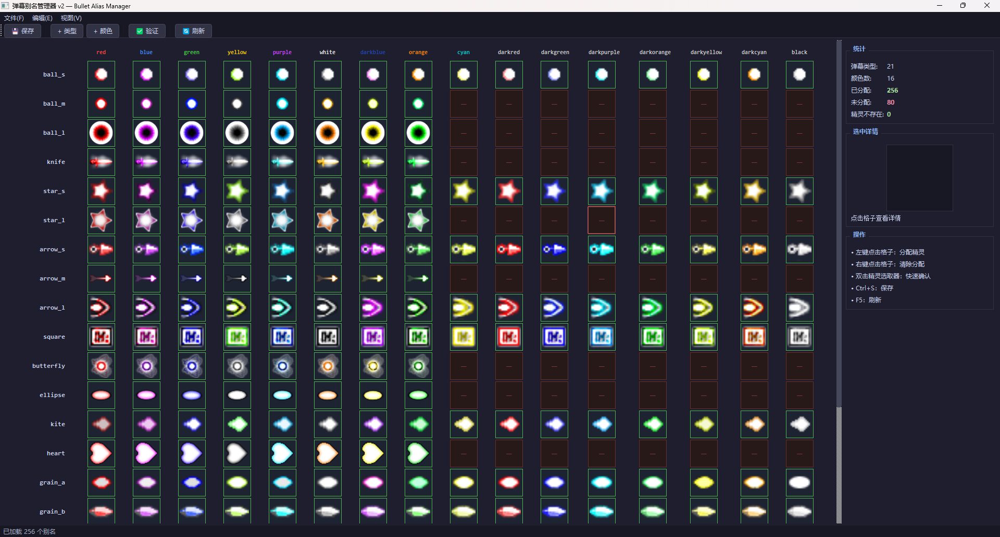
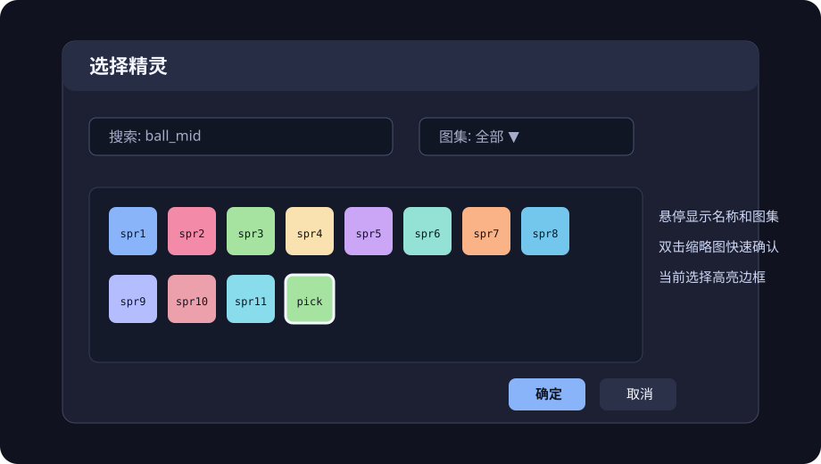

# pystg 编辑器工具指南

> 本文档只介绍关卡编辑器之外的独立资产工具。代码驱动关卡编辑器见
> [产品愿景](EDITOR_PRODUCT_VISION.md)。

---

## 目录

1. [概览](#_1-概览)
2. [依赖安装](#_2-依赖安装)
3. [独立工具启动器](#_3-独立工具启动器)
4. [弹幕别名管理器](#_4-弹幕别名管理器)
5. [纹理资产编辑器](#_5-纹理资产编辑器)
6. [自机编辑器](#_6-自机编辑器)
7. [共享模块说明](#_7-共享模块说明)
8. [常见问题](#_8-常见问题)

---

## 1. 概览

pystg 提供多套可视化工具，用于管理游戏资产配置：

| 工具 | 文件 | 用途 |
|------|------|------|
| **弹幕别名管理器** | `tools/bullet/bullet_alias_manager.py` | 管理弹幕类型+颜色→精灵的映射 |
| **纹理资产编辑器** | `tools/asset/asset_manager_qt.py` | 编辑精灵图集裁切区域、动画帧、激光配置 |
| **自机编辑器** | `tools/player/player_editor.py` | 编辑自机动画、射击类型、子机配置 |

这些工具不作为关卡编辑器插件。可以使用 `tools/editor_launcher.py`，也可以直接运行
每个工具的独立脚本。

所有编辑器共享统一暗色主题（Catppuccin Mocha），公共代码位于 `tools/editor_common.py`。

### 文件结构

| 文件 | 作用 |
|------|------|
| `tools/editor_launcher.py` | 独立资产工具启动器 |
| `tools/editor_common.py` | 共享模块：主题、缓存、数据加载 |
| `tools/bullet/bullet_alias_manager.py` | 弹幕别名管理器 |
| `tools/asset/asset_manager_qt.py` | 纹理资产编辑器 |
| `tools/player/player_editor.py` | 自机编辑器 |

---

## 2. 依赖安装

所有编辑器都需要 **PyQt5**：

```bash
pip install PyQt5
```

纹理资产编辑器还依赖引擎模块（`src/resource/unified_texture.py`），无需额外安装但需要确保项目目录完整。

---

## 3. 独立工具启动器

```bash
python tools/editor_launcher.py
```

### 功能

启动器提供弹幕、纹理、自机、敌人、立绘和背景工具卡片：

- 🎯 **弹幕别名** — 打开弹幕别名管理器
- 🖼️ **纹理编辑** — 打开纹理资产编辑器
- ✈️ **自机编辑** — 打开自机编辑器

每个编辑器在独立进程中运行，关闭启动器不会影响已打开的编辑器。

::: tip 直接启动
你也可以跳过启动器，直接运行各编辑器的 Python 脚本。
:::

---

## 4. 弹幕别名管理器

### 启动

```bash
python tools/bullet/bullet_alias_manager.py
```

### 是什么？

弹幕别名管理器用来建立**弹幕类型 + 颜色 → 精灵名称**的映射关系。

在 pystg 的关卡脚本中，发射弹幕时使用的是抽象名称：

```python
# 关卡脚本中的弹幕发射
ctx.spawn_bullet(x, y, speed, angle, bullet_type="ball_m", color="red")
```

引擎需要知道 `ball_m` + `red` 对应哪个具体的精灵图（如 `ball_mid1`）。
这个映射关系存储在 `assets/bullet_aliases.json` 中，由本工具管理。

### 界面布局



### 格子状态

网格中每个格子（SpriteCell）代表一个 (弹幕类型, 颜色) 组合，有三种状态：

| 状态 | 边框颜色 | 含义 |
|------|----------|------|
| 🟢 绿色 | 已分配，对应精灵存在 | 正常工作 |
| 🟡 黄色 | 已分配，但精灵找不到（显示⚠） | 配置了名称但图集中没有这个精灵 |
| 🔴 红色 | 未分配（显示—） | 还没有映射，需要手动设置 |

### 基本操作

#### 分配精灵

1. **左键点击**任意格子 → 弹出**精灵选取器**
2. 在选取器中可以：
    - 使用搜索框按名称过滤
    - 使用下拉框按图集过滤
    - 浏览缩略图网格
3. **双击**缩略图 → 快速确认选择
4. 或者先**单击**选中，再点"确定"

#### 清除分配

- **右键点击**格子 → 弹出菜单 → "清除此格子"

#### 添加弹幕类型

- 工具栏 "添加类型" → 输入新的别名（如 `my_bullet`）
- 新类型会出现在网格最后一行，所有颜色初始为未分配

#### 添加颜色

- 工具栏 "添加颜色" → 输入新颜色名（如 `pink`）
- 新颜色会添加为网格的新列

#### 删除弹幕类型 / 颜色

- 菜单 "编辑" → "删除弹幕类型..." / "删除颜色..."
- 选择要删除的项目后确认

#### 验证

- 工具栏 "验证" 或菜单 "编辑" → "验证所有"
- 检查所有已分配的精灵名是否在图集中存在
- 结果显示在弹窗中

#### 保存

- 工具栏 💾 / 菜单 "文件" → "保存" / `Ctrl+S`
- 保存到 `assets/bullet_aliases.json`
- 关闭窗口时如有未保存修改会提示

### 精灵选取器

弹出的精灵选取器提供所有可用精灵的可视化浏览：



- 每行 10 个缩略图（64×64 像素）
- 鼠标悬停显示精灵名称和所属图集
- 已在当前格子中选中的精灵会高亮标记

### 输出文件格式

保存的 `assets/bullet_aliases.json` 格式如下：

```json
{
  "version": "1.0",
  "mapping": {
    "ball_m": {
      "red": "ball_mid1",
      "blue": "ball_mid2",
      "green": "ball_mid3",
      "purple": "ball_mid4",
      "orange": "ball_mid5",
      "darkblue": "ball_mid6",
      "white": "ball_mid7",
      "yellow": "ball_mid8"
    },
    "ball_s": {
      "red": "ball_small1",
      "darkred": "ball_small2",
      "blue": "ball_small3",
      ...
    }
  }
}
```

### 与引擎的关系

引擎的 `StageContext`（位于 `src/game/stage/context.py`）在首次实例化时自动加载此文件：

```python
class StageContext:
    BULLET_ALIAS_TABLE: Dict[str, Dict[str, str]] = {}

    @classmethod
    def load_bullet_aliases(cls, path="assets/bullet_aliases.json"):
        # 读取 JSON 并填充 BULLET_ALIAS_TABLE
        ...

    def _resolve_sprite_id(self, bullet_type: str, color: str) -> str:
        # 1. 优先查 BULLET_ALIAS_TABLE
        type_entry = self.BULLET_ALIAS_TABLE.get(bullet_type)
        if type_entry:
            sprite = type_entry.get(color)
            if sprite:
                return sprite
        # 2. 回退到旧的 BULLET_TYPE_MAP + COLOR_MAP
        ...
```

::: info 兼容性
即使 `bullet_aliases.json` 不存在，引擎也会回退到内置的 `BULLET_TYPE_MAP` / `COLOR_MAP` 硬编码映射。
新增的弹幕类型（如 `arrow_s`, `grain_a`, `kite` 等）只能通过 JSON 别名表使用。
:::

### 为什么不同类型的颜色数不同？

不同弹幕使用不同数量的精灵变体（ 沿用**LuaSTG 规范**）：

- **8 色**类型（如 `ball_m`, `knife`, `star_l`）：red, blue, green, purple, orange, darkblue, white, yellow
- **16 色**类型（如 `ball_s`, `star_s`, `square`, `grain_*`）：在 8 色基础上增加 darkred, darkblue, darkgreen, darkpurple, darkorange, darkyellow, cyan, darkcyan, black

后缀编号（如 `ball_mid1`, `ball_mid2`...）在不同类型中**不一定对应相同颜色**，所以需要这个工具来逐类型管理映射。

---

## 5. 纹理资产编辑器

### 启动

```bash
python tools/asset/asset_manager_qt.py
```

### 功能概述

纹理资产编辑器直接集成游戏引擎的 `UnifiedTextureManager`，可以编辑所有类型的精灵资产。

#### 支持的资产类型

| 类别 | 路径 | 说明 |
|------|------|------|
| 子弹 | `assets/images/bullet/` | 子弹精灵图集 |
| 激光 | `assets/images/laser/` | 激光纹理（head/body/tail 三段式） |
| 玩家 | `assets/images/player/` | 自机精灵 |
| 敌人 | `assets/images/enemy/` | 敌机精灵 |
| 道具 | `assets/images/item/` | 道具精灵 |
| 背景 | `assets/images/background/` | 关卡背景 |
| UI | `assets/images/ui/` | 界面元素 |

#### 主要功能

- **精灵裁切编辑**：在纹理图集上可视化选取精灵区域（rect）
- **中心点配置**：设定精灵旋转/渲染中心点
- **碰撞半径**：配置碰撞检测的圆形半径
- **动画帧编辑**：管理序列帧动画
- **激光三段预览**：head / body / tail 三段式激光的可视化预览
- **16 色变体组管理**：管理弹幕颜色变体组
- **实时预览**：所有修改即时显示效果

#### 数据存储

每个图集目录下的 JSON 文件（如 `assets/images/bullet/bullet1.json`）存储精灵定义：

```json
{
  "__image_filename": "bullet1.png",
  "sprites": {
    "ball_mid1": {
      "rect": [0, 0, 32, 32],
      "center": [16, 16],
      "radius": 8,
      "rotate": false
    },
    ...
  }
}
```

::: warning 修改立即生效
纹理编辑器的保存直接写入引擎使用的 JSON 配置文件，修改后重启游戏即可看到效果。
:::

---

## 6. 自机编辑器

### 启动

```bash
python tools/player/player_editor.py
```

### 功能概述

自机编辑器用于配置玩家角色的各项属性。

#### 主要功能

- **动画状态机**：编辑空闲 / 左移 / 右移 / 特殊动画状态及切换规则
- **精灵帧预览**：实时预览动画帧序列
- **射击类型**：配置主武器和副武器的弹幕发射参数
- **子机（Option）配置**：设定子机位置、动画、攻击行为
- **移动参数**：常速 / 低速移动速度配置

#### 数据存储

自机配置位于 `assets/players/<角色名>/config.json`：

| 路径 | 内容 |
|------|------|
| `assets/players/reimu/config.json` | 角色配置：动画、射击、子机等 |
| `assets/players/reimu/reimu.png` | 角色精灵图 |
| `assets/players/sakuya/config.json` | 角色配置 |
| `assets/players/sakuya/sakuya.png` | 角色精灵图 |

---

## 7. 共享模块说明

`tools/editor_common.py` 提供以下共用功能：

### 路径常量

```python
PROJECT_ROOT     # 项目根目录
ASSET_ROOT       # assets/ 目录
BULLET_IMAGE_DIR # assets/images/bullet/ 目录
BULLET_ALIASES_PATH  # assets/bullet_aliases.json 路径
PLAYERS_ROOT     # assets/players/ 目录
```

### 统一暗色主题

```python
from tools.editor_common import DARK_THEME, apply_dark_theme

# 方式1：直接设置 stylesheet
widget.setStyleSheet(DARK_THEME)

# 方式2：使用辅助函数
apply_dark_theme(widget)
```

主题基于 **Catppuccin Mocha** 配色方案，覆盖了 QMainWindow、QDialog、QMenu、QPushButton、QTableWidget、QTreeWidget、QLineEdit、QComboBox、QScrollBar 等常用控件。

### 精灵数据加载

```python
from tools.editor_common import (
    SpriteEntry,
    load_all_bullet_sprites,
    get_all_sprite_names,
    get_sprite_entry_map,
)

# 加载所有子弹图集
atlases = load_all_bullet_sprites()
# atlases = {"bullet1": [SpriteEntry(...), ...], "bullet2": [...]}

# 获取所有精灵名（集合）
all_names = get_all_sprite_names(atlases)

# 获取 name→entry 映射
entries = get_sprite_entry_map(atlases)
```

`SpriteEntry` 数据类：

```python
@dataclass
class SpriteEntry:
    name: str               # 精灵名称，如 "ball_mid1"
    atlas: str              # 所属图集名，如 "bullet1"
    texture_path: str       # 纹理 PNG 完整路径
    rect: (int,int,int,int) # 裁切区域 (x, y, w, h)
    center: (float, float)  # 中心点偏移
    radius: float           # 碰撞半径
    rotate: bool            # 是否旋转
```

### QPixmap 缓存

```python
from tools.editor_common import PixmapCache

# 预加载所有精灵（建议在 QApplication 创建后调用）
PixmapCache.ensure_all_loaded(atlases)

# 获取精灵的 QPixmap
pixmap = PixmapCache.get_sprite(sprite_entry)

# 按名称获取（需先加载）
pixmap = PixmapCache.get_sprite_by_name("ball_mid1")

# 创建占位符
placeholder = PixmapCache.make_placeholder(size=32, text="?")
```

### 别名 JSON 读写

```python
from tools.editor_common import (
    load_bullet_aliases,
    save_bullet_aliases,
    generate_default_aliases,
)

# 读取
mapping = load_bullet_aliases()
# mapping = {"ball_m": {"red": "ball_mid1", ...}, ...}

# 自动生成初始映射
atlases = load_all_bullet_sprites()
mapping = generate_default_aliases(atlases)

# 保存
save_bullet_aliases(mapping)
```

---

## 8. 常见问题

### 启动报错 ModuleNotFoundError: No module named 'PyQt5'

安装 PyQt5：

```bash
pip install PyQt5
```

### 弹幕别名管理器打开后网格是空的

可能原因：

1. `assets/bullet_aliases.json` 不存在 — 工具会自动根据实际精灵生成默认映射
2. `assets/images/bullet/` 目录下没有 JSON 配置或 PNG 图片
3. 确保从项目根目录启动，或使用绝对路径

### 保存后游戏没有生效

引擎在 `StageContext` 首次实例化时加载别名表。确认：

1. 关卡脚本里使用的 `bullet_type` 和 `color` 名称与 JSON 中一致
2. 重新启动游戏（别名表在进程启动时加载，不会热重载）

### 纹理编辑器加载失败

纹理编辑器依赖引擎的 `UnifiedTextureManager`。确保 `src/resource/unified_texture.py` 存在且没有语法错误。

### 如何添加全新的弹幕类型？

1. 在纹理编辑器中为新精灵图集添加裁切定义
2. 在弹幕别名管理器中点击 "添加类型"，输入新的别名
3. 逐颜色点击格子，在精灵选取器中选择对应精灵
4. 保存 → 在关卡脚本中即可使用新类型名

### 如何扩展编辑器？

如果需要创建新的编辑器工具：

1. 在 `tools/` 下创建新的 `.py` 文件
2. 导入 `editor_common` 使用共享主题和工具函数
3. 在 `editor_launcher.py` 中添加一张新的 `ToolCard`

```python
from tools.editor_common import DARK_THEME, apply_dark_theme, PROJECT_ROOT

class MyEditor(QMainWindow):
    def __init__(self):
        super().__init__()
        apply_dark_theme(self)
        ...
```
