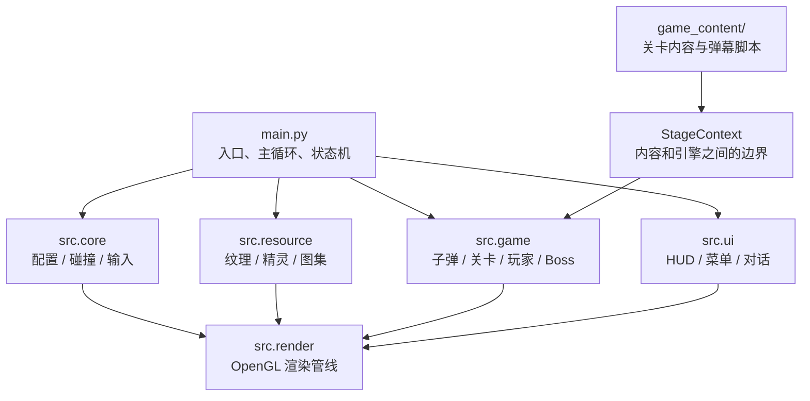
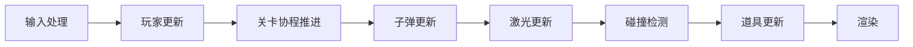
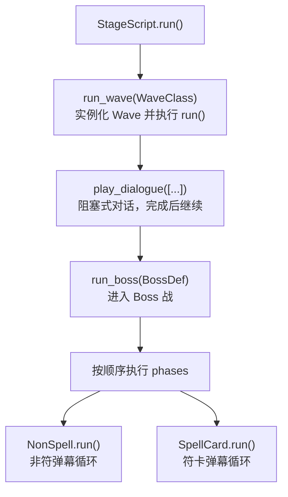
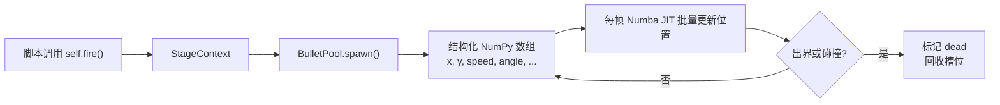
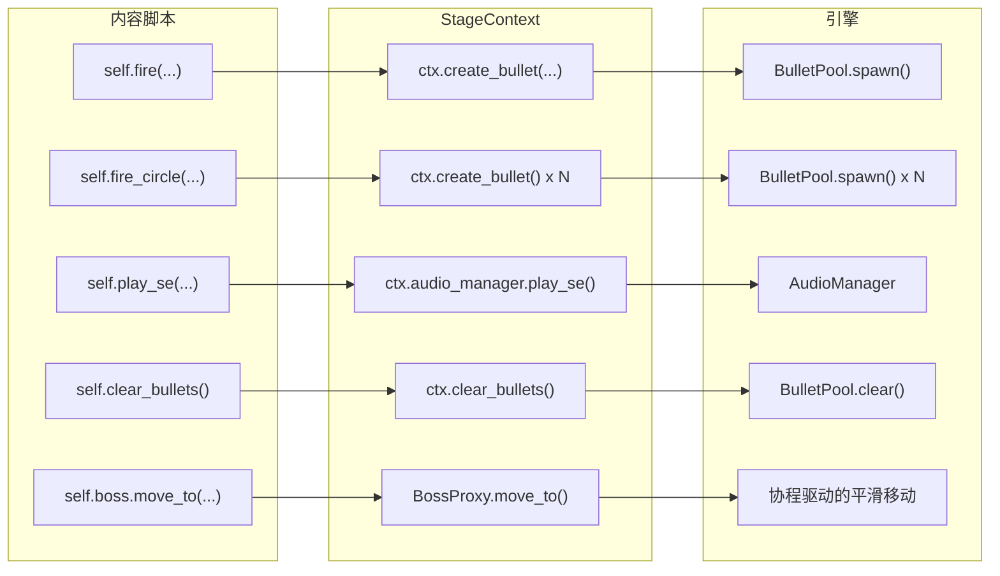
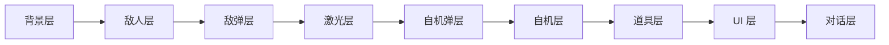
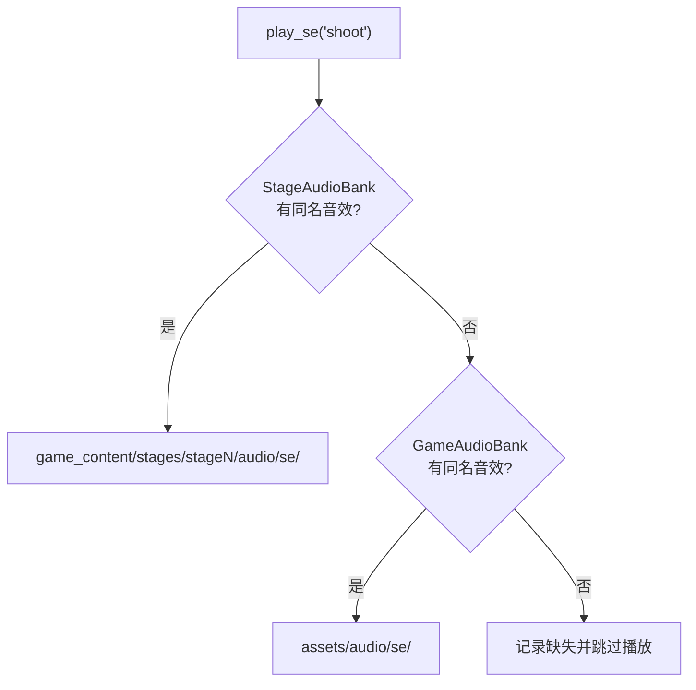

# 架构概览

## 分层结构

引擎和内容通过 `StageContext` 桥接——内容脚本只能通过 `ctx` 调用引擎能力，不能直接 import 引擎内部模块。

## 模块说明

### src/core — 基础设施

| 模块 | 职责 |
|------|------|
| `config.py` | 游戏配置常量（分辨率、游戏区域、帧率） |
| `collision.py` | 碰撞检测（Numba JIT 加速，支持判定点和擦弹） |
| `interfaces.py` | 核心接口定义 |
| `sprite_registry.py` | 全局精灵注册表 |

### src/resource — 资源管理

| 模块 | 职责 |
|------|------|
| `texture_asset.py` | 纹理图集加载、精灵定义、UV 坐标计算 |
| `unified_texture.py` | 统一纹理管理器（跨图集查找精灵） |
| `sprite/` | 精灵管理 |
| `asset_manager.py` | 资产加载和缓存 |

### src/game — 游戏逻辑

| 模块 | 职责 |
|------|------|
| `bullet/optimized_pool.py` | 高性能子弹池（结构化 NumPy 数组 + Numba） |
| `player/` | 玩家系统（移动、射击、动画、子机） |
| `stage/` | **关卡系统核心**——下面单独说 |
| `boss/` | Boss 管理器 |
| `laser.py` | 激光系统（直线 / 曲线，池化管理） |
| `item.py` | 道具系统 |
| `audio.py` | 音频系统（双层：全局 + 关卡私有） |
| `background_render/` | 3D 背景渲染（透视投影、雾效） |

### src/game/stage — 关卡系统（核心）

这是内容开发者最需要理解的部分：

| 模块 | 职责 |
|------|------|
| `stage_base.py` | `StageScript` 基类——关卡主脚本继承它 |
| `context.py` | `StageContext`——引擎与内容的桥梁 |
| `spellcard.py` | `SpellCard` / `NonSpell` 基类 |
| `wave_base.py` | `Wave` 基类 |
| `enemy_script.py` | `EnemyScript` 基类 |
| `boss_base.py` | `BossBase`——管理符卡阶段序列 |
| `preset_enemy.py` | 预设敌人系统（JSON 配置驱动） |
| `dialog_manager.py` | 对话管理 |
| `practice.py` | 练习模式 |

### src/render — 渲染

| 模块 | 职责 |
|------|------|
| `renderer.py` | 主渲染器（协调所有子渲染器） |
| `optimized_bullet_renderer.py` | 子弹批量实例化渲染 |
| `laser_renderer.py` | 激光渲染（直线/曲线几何体构建） |
| `player_renderer.py` | 玩家精灵渲染 |
| `item_renderer.py` | 道具渲染 |

### src/ui — 界面

| 模块 | 职责 |
|------|------|
| `hud.py` | HUD（残机、符卡、分数、Power） |
| `bitmap_font.py` | 位图字体渲染 |
| `dialog_gl_renderer.py` | 对话框 OpenGL 渲染 |
| `main_menu_renderer.py` | 主菜单 |
| `loading_renderer.py` | 加载画面 |

## 数据流

### 一帧的执行顺序

### 关卡系统内部

每个协程（`run()`）内部通过 `await self.wait(N)` 控制时间，引擎每帧推进一步。

### 子弹生命周期

## StageContext：引擎与内容的桥梁

内容脚本（SpellCard、Wave、EnemyScript）不直接操作 BulletPool 或 Player。
它们通过 `self.fire()` / `self.fire_circle()` 等方法，最终委托给 `StageContext`，由 Context 调用引擎内部 API。

这样做的好处：

- 内容脚本不依赖引擎实现细节
- 引擎内部重构不影响已有关卡
- 可以对 Context 做 mock 进行单元测试

## 渲染管线

渲染按层级从后到前：

子弹渲染使用 OpenGL 实例化绘制（instanced rendering），一次 draw call 绘制所有同类型子弹。

## 音频系统

双层查找机制：

关卡私有音效可以覆盖全局同名音效。BGM 同理。

## 激光系统

两种激光类型：

| 类型 | 说明 |
|------|------|
| 直线激光 `Laser` | 三段式（头/身/尾），支持展开→持续→收缩动画 |
| 曲线激光 `BentLaser` | 沿路径弯曲，记录历史位置形成轨迹 |

通过 `LaserPool` 统一管理，渲染由 `LaserRenderer` 处理，支持 16 种预设颜色。
