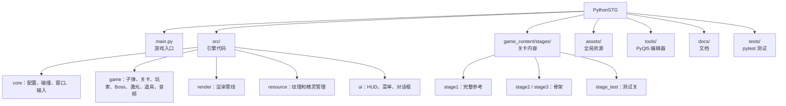

# 快速开始

## 环境要求

- **Python 3.10+**（推荐 3.12，CI 测过的版本）
- 支持 **OpenGL 3.3+** 的显卡（基本所有 2010 年后的核显都行）
- 操作系统：Windows / Linux（macOS 未测试）

## 安装依赖

```bash
git clone https://github.com/qwqpap/PythonSTG.git
cd PythonSTG
pip install -r requirements.txt
```

`requirements.txt` 已锁定一组互相兼容的版本（包括 `numpy==2.2.4` 和 `numba==0.63.1`）。
如果要升级 NumPy / Numba，请同步升级两者，否则会报 `Numba needs NumPy x.x or less`。

如果还要用编辑器工具或跑测试：

```bash
pip install -r requirements-dev.txt
pip install PyQt5
```

## 运行游戏

```bash
python main.py                    # 默认 Stage 1
python main.py --stage=stage2     # 指定关卡
python main.py --stage=asset_preview  # 资产预览（浏览所有弹型/敌人）
python main.py --debug            # Debug 模式：菜单可跳转任意 Wave / Boss / 符卡
python main.py --profile          # 性能分析
```

`--debug` 是开发期最有用的开关：标记了 `DEBUG_BOOKMARK = True` 的 Wave / SpellCard 会出现在跳转菜单里，省去每次从头打到 Boss 的时间。

## 项目结构



## 引擎与内容的边界

PySTG 把**引擎**和**内容**彻底分开：

- `src/` 是引擎，提供子弹池、渲染、碰撞、激光、音频等底层能力
- `game_content/` 是内容，只描述「发生什么」——弹幕怎么飞、敌人怎么动、Boss 出什么招

写弹幕脚本时，你只需要 import 几个基类：

```python
from src.game.stage.spellcard import SpellCard, NonSpell   # 符卡 / 非符
from src.game.stage.wave_base import Wave                   # 道中波次
from src.game.stage.enemy_script import EnemyScript         # 敌人脚本
from src.game.stage.stage_base import StageScript, BossDef  # 整面流程
from src.game.stage.boss_base import nonspell, spellcard    # Boss 阶段组合
```

所有这些类都通过 `self.fire()` / `self.wait(N)` / `self.ctx.xxx` 调用引擎，不直接 import 引擎内部模块。

## 第一份脚本

```python
class MySpell(SpellCard):
    name = "火符「Example」"
    hp = 1000
    time_limit = 45

    async def run(self):
        angle = 0
        while True:
            self.fire_circle(count=12, speed=2.0, start_angle=angle, color="red")
            angle += 10
            await self.wait(15)   # 暂停 15 帧（≈0.25 秒）
```

`await self.wait(N)` 让协程暂停 N 帧，引擎每帧推进一步。这就是 PySTG 弹幕脚本的核心模式。

完整 API 见 [弹幕脚本开发指南](STAGE_SCRIPTING_GUIDE.md)。

## 一个关卡长什么样

| 路径 | 作用 |
|------|------|
| `game_content/stages/stage1/__init__.py` | 关卡包入口 |
| `game_content/stages/stage1/stage_script.py` | 整面流程，必需 |
| `game_content/stages/stage1/waves/` | 道中波次，如 `opening_wave.py`、`fairy_wave.py` |
| `game_content/stages/stage1/spellcards/` | Boss 符卡，如 `nonspell_1.py`、`spell_1.py` |
| `game_content/stages/stage1/enemies/` | 可复用敌人定义 |
| `game_content/stages/stage1/dialogue/` | 对话脚本 |
| `game_content/stages/stage1/audio/` | 关卡私有音频，可覆盖全局同名音效 |

`stage_script.py` 控制整个关卡的流程：

```python
class Stage1(StageScript):
    id = "stage1"
    name = "Stage 1"
    bgm = "00.wav"
    boss_bgm = "01.wav"

    async def run(self):
        await self.run_wave(OpeningWave)           # 道中波次
        await self.run_wave(FairyWave)

        await self.play_dialogue([                  # Boss 前对话
            ("Hinanawi_Tenshi", "left", "准备好了吗？"),
            ("Reiuji_Utsuho", "right", "来吧！"),
        ])

        await self.run_boss(self.boss)              # Boss 战
```

对话立绘渲染参数位于 `assets/ui/dialog_portrait_layout.json`，可用编辑器调整：

```bash
python tools/dialog/dialog_portrait_editor.py
```

## 下一步

- **写弹幕** → [弹幕脚本开发指南](STAGE_SCRIPTING_GUIDE.md)
- **快速出杂兵** → [敌人预设系统](ENEMY_PRESET_SYSTEM.md)
- **管理资产** → [编辑器工具](EDITOR_TOOLS_GUIDE.md)
- **了解引擎内部** → [架构概览](architecture.md)

写内容时优先参考 `game_content/stages/stage1/` 下的现有脚本——这是当前最完整的实现样例。
